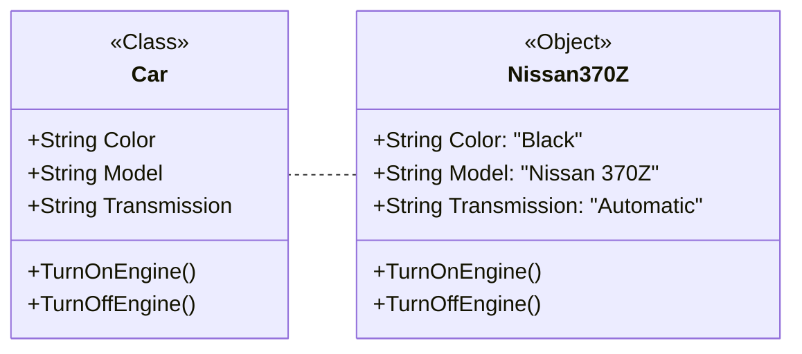

# Object-Oriented Programming
### Introduction

  <i>What is Object-Oriented Programming?</i>

 They are a way to represent information about a "real world" 
 idea and they contain ways to manipulate that information.
Is a programming paradigm based on the concept of "objects", 
which contain information in the form of fields 
(sometimes also referred to as attributes or properties) 
and code in the form of methods. The object-oriented programming has key concepts
called "pillars of object-oriented programming". These are: 
<code class="fw-700">inheritance</code>, <code class="fw-700">abstraction</code>, <code class="fw-700">polymorphism</code> and <code class="fw-700">encapsulation</code>.

    OOP has a lot of fundamental concepts, let's start with the most important:

## Class

    A class is a kind of "<i>template</i>" in which the attributes 
    and methods of a type of object are defined. 
    This template is created to be able to create objects easily. 
    The method of creating new objects by reading and retrieving the 
    attributes and methods of a class is known as instantiation.

 
This is an example of a class of a Car:

{: .bg-white }

    In this example we can see how "Nissan 370Z" is an <b>instance</b> of the <code>Car class</code>. 
    Objects receive the attributes of the instantiated class.

<code>Car Class:</code>


public class Car{
  public String color;
  public String model;
  public String transmission;

  public void turnOnEngine(){
    System.out.println("Engine Turned On.");
  }
  
  public void turnOffEngine(){
    System.out.println("Engine Turned Off.");
  }

  public Car(String color,String model, String transmission){
    this.color = color;
    this.model = model;
    this.transmission = transmission;
  }
}




<code>Instantiation of the Car Class:</code>


class Main {
  public static void main(String[] args) {
    Car myCar = new Car("Black","Nissan 30Z", "Automatic");
    System.out.println(myCar.color); // Will print: Black.
  }
}




## Inheritance

    Inheritance allows classes to inherit features of other classes. 
    Parent classes extend attributes and behaviors 
    to child classes. Inheritance supports reusability.

    If basic attributes and behaviors are defined in a parent class, 
    child classes can be created, extending the functionality of the 
    parent class <b>and adding additional attributes and behaviors</b>.

Parent classes are also known as superclasses or base classes. 
The child class can also be called a subclass, derived class, or extended class.

## Encapsulation

## Abstraction

    

## Polymorphism

    

introducir valor de num1
inoikhkh