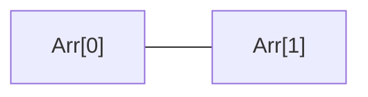

The content on this page is for testing purposes only.


<p class="note-title">
  This is a note
</p>

<p class="highlight">
  This is a note
</p>

<p>Code Example</p>

```js
// Javascript code with syntax highlighting.
var fun = function lang(l) {
dateformat.i18n = require('./lang/' + l)
return true;
}
```



Some code




<p>Graph Example</p>


{: .bg-white }

site.url: {{ site.url }}

link:  

page.url: {{ page.url }} <-- <code><i>specified by permalink</i></code>

page.path: {{ page.path }}









